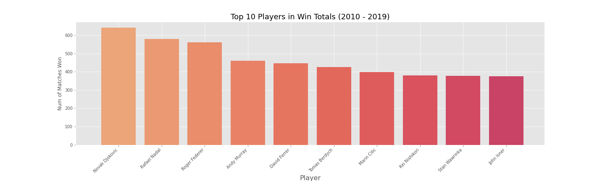
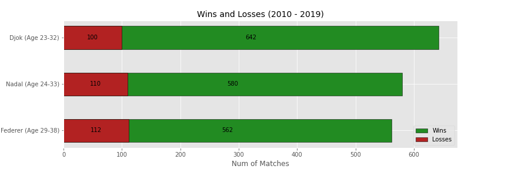
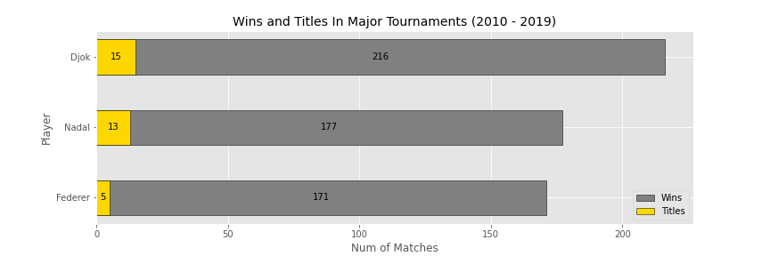
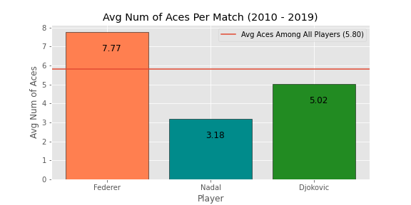
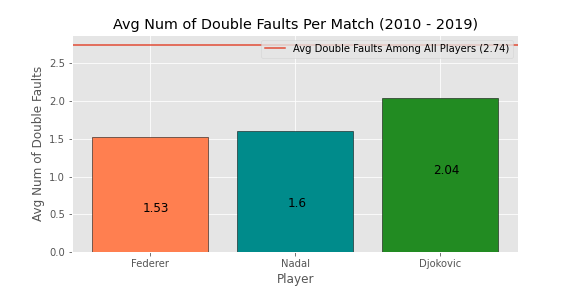
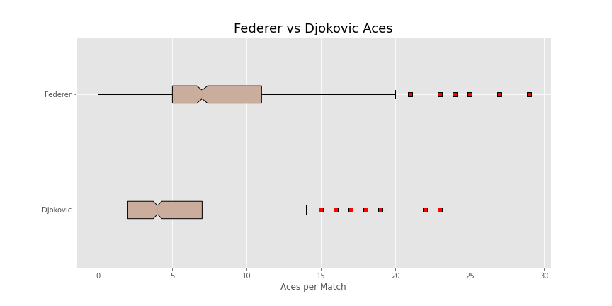
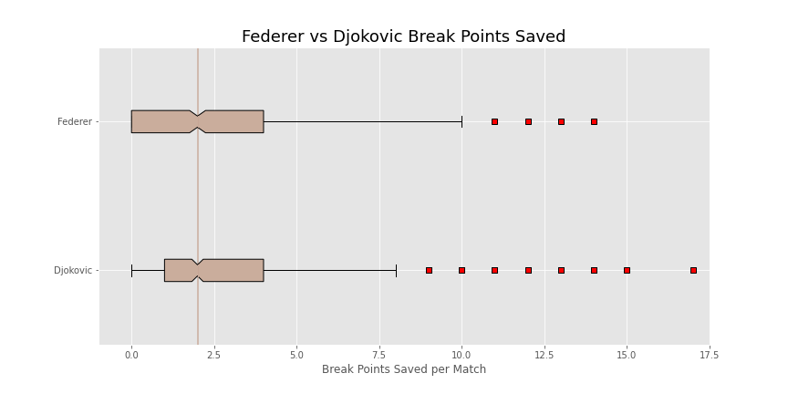
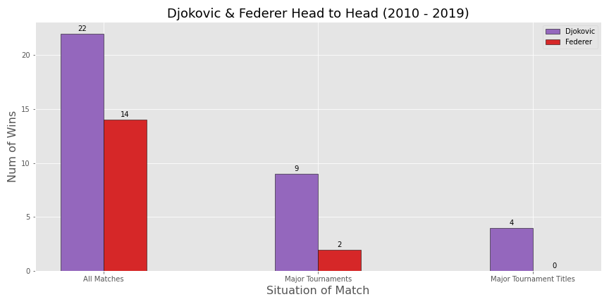
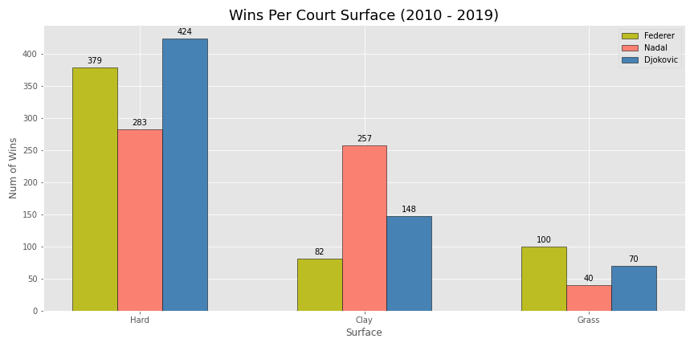

# Capstone 1 - Comparing Tennis Players from the Past Decade

 <a href="https://docs.google.com/presentation/d/1ergeUd-3yKRYDboZVsn6XLTp1zicp76Pi_rsCAbOhSc/edit#slide=id.p">Presentation</a>

## Table of Contents
- [Background](#background)
- [Data](#data)
- [EDA](#exploratory-data-analysis)
- [Hypothesis Tests](#hypothesis-testing)
- [Results](#final-conclusion)

## Background
For my first capstone project I wanted to compare tennis players throughout the past decade. Since covid canceled the 2020 season and the 2021 season is still ongoing I looked at seasons 2010-2019. The motivation for this stems from the fact that I grew up in a household where tennis was popular, but I never could contribute much to conversations so I wanted to explore the data to gain a better insight into the sport.

## Data
* [ATP Tennis 2019](https://github.com/JeffSackmann/tennis_atp/blob/master/atp_matches_2019.csv)
* [Extra Data](https://github.com/JeffSackmann/tennis_atp)

**Desc:** Dataset includes stats for every tournament played in 2019 including player name, tournament, court surface, winner, loser, score, 1st serve, 2nd serve and many more. Things I can explore with this data would be if first serves made correlate to more matches won? Are there more breakpoints on harder surfaces (hard, grass) than slower surfaces (clay)? Reject or fail to reject that certain parts of the world perform better on certain surfaces. I could also compare generations and see which stats are most important for people that win. Taking that a step further, in recent generations tennis has been dominated by a few athletes; (ie: Federer, Nadal, Djokovic) I could see which stats for lower rank players are good indicators that they will be able to beat them. Test the hypothesis that these indicators do in fact lead to upsets of those 3 players.

## Exploratory Data Analysis
When it came to selecting who to focus on I looked at players total wins, which has been dominated by three individuals during this time period.

  1. Novak Djokovic
  2. Rafael Nadal
  3. Roger Federer

Taking a closer look at their overall records we can see even clearer how dominate these three have been with winning percentages of...
  - Djokovic: 86.5%
  - Nadal: 84.1%
  - Federer: 83.4%

I also wanted to explore their record in major tournaments since that metric is frequently used in the debate for who is the greatest player. Combined they won an impressive 33/40 possible major tournament titles with over 550 wins. Based on this information I went forward with the assumption that Djokovic would most likely be declared the winner.

The columns used for testing from the dataset were:
  1. Aces
  2. Serve Points
  3. 1st Serves Made
  4. 2nd Serves Made
  5. 1st Serve Points Won
  6. 2nd Serve Points Won
  7. Serve Games
  8. Break Points Saved
  9. Double Faults
  10. Break Points Faced

It's important to note that its consider better to have less of the last two stats in the list. Double faults are gifting your opponent a point on your own serve and break points faced are indicator that you are behind in the match. All the other stats it's considered better to have more of. 

The final thing I explored was how the three players compared to remaining field average in terms of some of these stats.

 

As you can see the trio perform much better than average at both maximizing aces per match and minimizing the number of double faults per match.

## Hypothesis Testing

### Hypothesis Test 1

Utilizing the MannWhitneyU test I faced each other three chosen tennis players up against each other in order to determine the ultimate winner. The first of the matchups was Federer vs Nadal and my hypotheses were as follows:

$$ H_0: \ Federer \leq Nadal $$

$$ H_A: \ Federer > Nadal $$

$$ \alpha = 0.05 $$

|   | Federer Wins  | Nadal Wins  | Total Trials  | P-Value  | Reject Null? |
|---|---|---|---|---|---|
| Aces  | 379443  | 85617  | 465060  | 0  | Reject Null  |
| Serve Points  | 244524  | 220536  | 465060  | 0.04956  | Reject Null  |
| 1st Serve In  |  220722 |   244337.5 |  465060  |  0.94779  | Fail to Reject Null  |
| 1st Serve Points Won  |  252314  |  212709 | 465023  | 0.00326  |  Reject Null |
| 2nd Serve Points Won  | 292803   | 172260  | 465063  |  0 |  Reject Null |
| Service Games  | 263752.5  | 201334.5  | 465087  |  0.00001 | Reject Null  |
| Break Points Saved  | 203418  | 261642  |  465060 | 0.99997  |  Fail to Reject Null |
| Wins  |  230960 |  234100 |  465060 | 0.63221  |  Fail to Reject Null |
| Double Faults  |  227241 | 237819  |  465060 | 0.22702  | Fail to Reject Null  |
| Break Points Faced  | 197077  |  267983 |  465060 |  0 | Reject Null  |

The Mann-Whitney U test is the nonparametric equivalent of the two sample t-test. While the t-test makes an assumption about the distribution of a population (i.e. that the sample came from a t-distributed population), the Mann Whitney U Test makes no such assumption. It compares every metric I used for every match these two played. The "____ wins" is the test statistic that is returned from the function and we use the p-value to decided whether or not we reject the null hypothesis. If the p-value is *less than* the alpha value we set at 0.05 then we reject the null hypothesis and can say that Federer is better than Nadal in terms of that metric. Then I totaled up how many times we rejected or failed to reject the null hypothesis to determine who won the individual match-up. In this case we rejected the null hypothesis 6/10 times so Federer beat Nadal.

### Hypothesis Test 2

Federer moved along to the second match-up against the assumed winner, Djokovic.

$$ H_0: \ Djokovic \leq Federer $$

$$ H_A: \ Djokovic > Federer $$

$$ \alpha = 0.05 $$

Instead of overwhelming you with numbers I've made the resulting table from my MannWhitneyU test much more simple now that you understand the basic concept of what is happening behind the scenes.

|   | Reject Null? |
|---|---|
| Aces  | ❌ |
| Serve Points  | ❌  |
| 1st Serve In  | ❌  |
| 1st Serve Points Won  | ❌ |
| 2nd Serve Points Won  | ❌ |
| Service Games  | ❌  |
| Break Points Saved  | ✅ |
| Wins  | ✅ |
| Double Faults  | ❌  |
| Break Points Faced  | ❌ |

❌ = fail to reject null hypothesis
✅ = reject null hypothesis

In this second matchup we only rejected the null hypothesis 2/10 times! This means that Djokovic may be worse than or equal to Federer in terms of these metrics even though he has significantly more wins. This was *very surprising*.

I had to investigate this a little further. The first thing to note with the dataset is that the stats primarily revolve around serving, which is one of Federer's strongest attributes while Djokovic is known more as a player with great defense. Both of these points are made a little more clear with the following images.

 

Another thing to take into account is there head to head record against each other. Initially, I made the assumption that Djokovic would be declared the winner based on his major tournament record and number of titles. However if you take a look at their records they've played each other 36 times over the course of this decade with Djokovic winning 22/36 matches. In major tournaments they've played each other 11 times with Djokovic winning 9 of those matches. And in tournament *title* games Djokovic is a perfect 4-0 against him. Had some of these matches gone a different way I wouldn't have likely made that initial assumption and really these tests came down to who is the better server.

The other unique factor about tennis to take into account is the fact that the playing surface(s) are not the same everywhere you play. The most commong three are hard court (concrete), clay, and grass.

These different surfaces have a significant impact on player performance as well. Federer tends to favor grass surfaces, but the least amount of matches per season are played on grass. And although he doesn't perform poorly on hard court, he has to deal with Djokovic who tends to be the most dominate on hard court, making those major tournament wins & titles more difficult to come by. 

### Hypothesis Test 3

As a sanity check I performed the final hypothesis test with Nadal and Djokovic. Here I'd be very surprised if Djokovic lost to Nadal.

$$ H_0: \ Nadal \leq Djokovic $$

$$ H_A: \ Nadal > Djokovic $$

$$ \alpha = 0.05 $$

|   | Reject Null? |
|---|---|
| Aces  | ❌ |
| Serve Points  | ❌  |
| 1st Serve In  | ❌  |
| 1st Serve Points Won  | ❌ |
| 2nd Serve Points Won  | ❌ |
| Service Games  | ❌  |
| Break Points Saved  | ❌ |
| Wins  | ❌ |
| Double Faults  | ✅   |
| Break Points Faced  | ❌ |

❌ = fail to reject null hypothesis
✅ = reject null hypothesis

Thankfully, I wasn't surprised with the results this time. We rejected the null hypothesis only 1/10 so we can say that Nadal is less than or equal to Djokovic in terms of every metric except for double faults. 

## Final Conclusion
After performing these hypothesis tests my final ranking of the players is:
  1. Federer
  2. Djokovic
  3. Nadal

Thanks for taking a look!